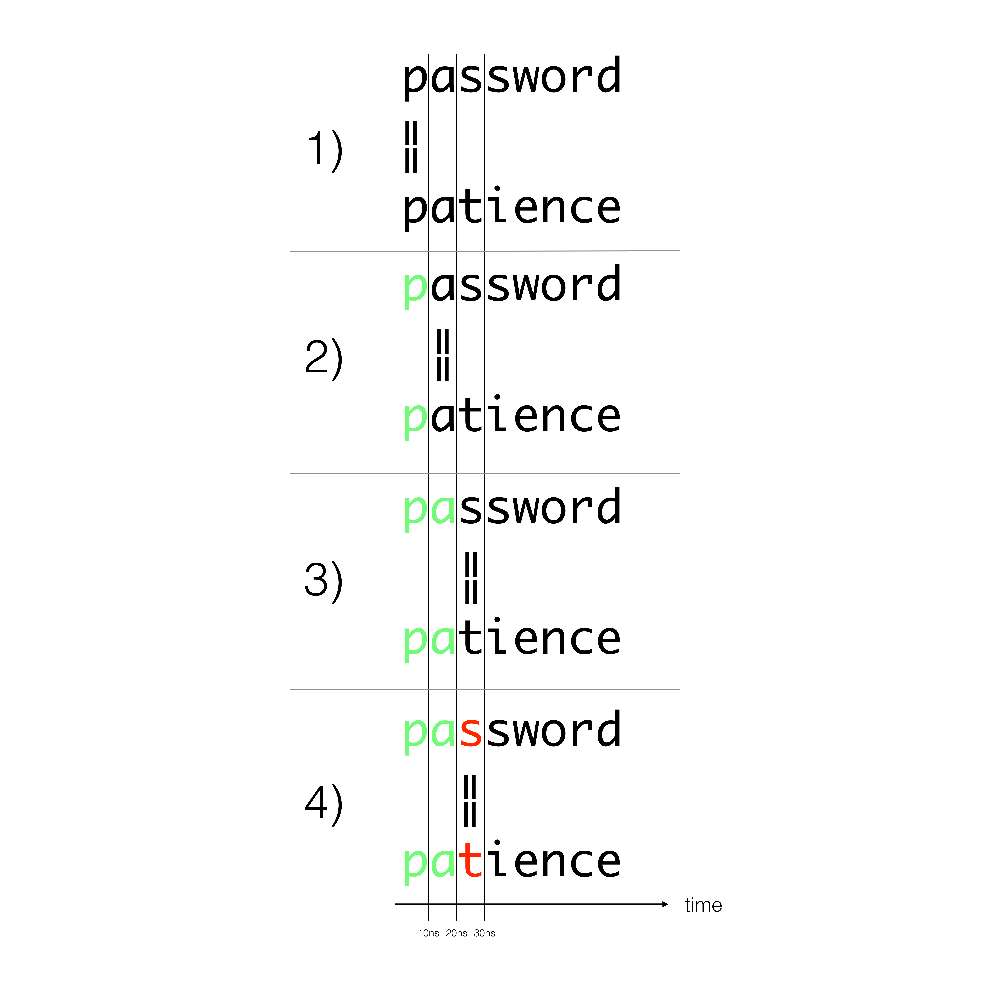

Timing Attacks are a particular type of attacks that use flaws in code that impact the execution time to discover hints about secrets.

# TL;DR

Don't use string comparison `==` when checking for secrets or token equality. Use constant-time implementations.

# Vulnerable code

For example, this Python code is vulnerable to timing attacks:

```python
def is_authorized(token):
    if token == 'MY_SECURE_TOKEN':
        return True
    else:
        return False
```

# Vulnerability explanation

While being very simple, it's vulnerable. Why? The code that compares two string is equivalent to this one:

```python
def str_equals(first_string, second_string):
    if len(first_string) != len(second_string):
        return False

    for c1, c2 in zip(first_string, second_string):
        if c1 != c2:
            return False

    return True
```

It iterates over each character of the two string and returns `False` as soon as two characters differ. This means that comparing two strings can take differing amounts of time when depending on the location of the first difference.



The difference appears negligible, and it is indeed very small, but statistics dictates that even small differences can be detected with enough measurements. Moreover, network jitter can now be precisely modeled and can be removed from measures over the internet. According to [one of the reference paper on the subject](http://www.cs.rice.edu/~dwallach/pub/crosby-timing2009.pdf), "we have shown that, even though the Internet induces significant timing jitter, we can reliably distinguish remote timing differences as low as 20µs".

Timing attacks can occur when the attacker controls the value that is compared to the secret. For an authorization key, for example, if he discovers that the first character is `f`, he can start sending keys beginning with `f` to find the next characters.

# Non-vulnerable code

The solution is to compare the two strings in a way that is not dependent on the length of the strings. This algorithm is called constant time string comparison.

To do this successfully the algorithm must:

 - Compare all of the characters before returning true or false.
    - returning early will leak information.
 - Compare strings of equal length
    - if one string is longer or shorter, you'll return early and leak information about string length.

Django provides a function [`constant_time_compare`](constant_time_compare) that can be used to securely check two strings.

The python standard lib also provides the function [`hmac.compare_digest`](https://docs.python.org/3/library/hmac.html#hmac.compare_digest) only in Python 3.3+.

# Example of attack



## References:

- [https://codahale.com/a-lesson-in-timing-attacks/](https://codahale.com/a-lesson-in-timing-attacks/)
- [http://www.cs.rice.edu/~dwallach/pub/crosby-timing2009.pdf](http://www.cs.rice.edu/~dwallach/pub/crosby-timing2009.pdf)
